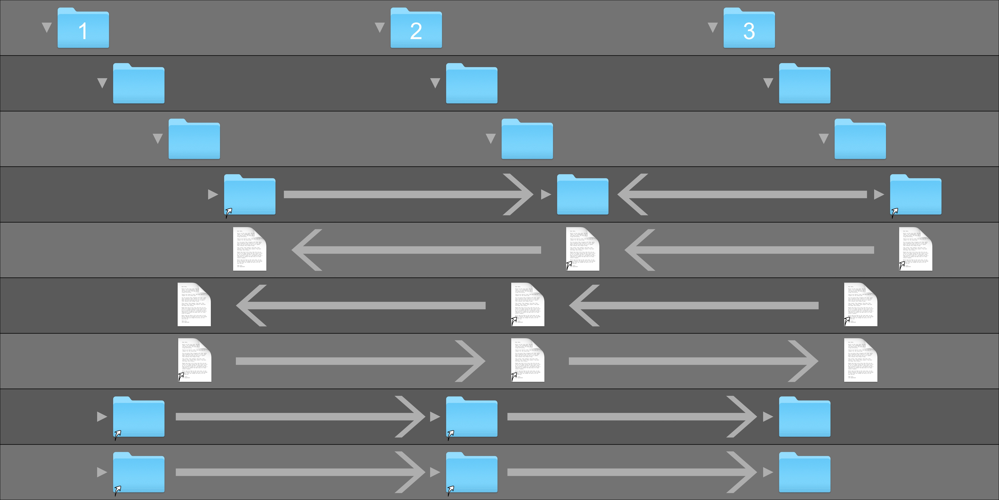

*This project is still pre-pre-alpha, so if you somehow stumble onto this page:*
* *Use at your own discretion*
* *Feel free to help out by submiting a feature request, pull request, or an issue*

*Thank you, that was all; I'll now hand it over to the poorly written pre-pre-alpha documentation.*

# Layers

`layers` is a CLI tool that allows you create folder on multiple different drives, and have their content mirrored via symlinks, while being able to controll which drive contains the original one.

To me, this is especially usefull for my Plex Media setup. Where I want all media of the same type in the same directory, so they can be kept in the same library, but I dont necesarilly want aaalll the series I've downloaded on the same drive, but I still definetly want high bitrate video that I'm going to watch in the near future on one of the fast drives.


# Usage

You create one or more *layer* to a *layer set*. Each *layer* in the has a *level* number, used to easier reference them in the future.

To create a new *layer set* with it's first layer run

```
$ layers new /path/to/first/layer
```

This will create a new layer, to a new layer set.

To create a second layer for the same layer set you can either run

```bash
$ cd /path/to/first/layer
$ layers new /path/to/second/layer
```

or, if you prefer

```bash
$ layers -l /path/to/first/layer new /path/to/second/layer
```

Every command is run with a *layer* as target. The *layer* target is automatically set to the whatever *layer* the current working directory is in. The `new` command, however, will create a new *layer set* if no *layer* target is found. If a *layer* target is found, it will create a new layer for that layer set.


Once you have done that, you can start filling the different layers with files you want in each of them. When you want to, you can run `sync` to create the symlinks between the directories

```bash
#cwd: /path/to/one/of/the/layers
$ layers sync
```


You can easily rename files, and move them between layers with the `mv` command

```bash
#cwd: /path/to/one/of/the/layers

# Move the file one level up
$ layers mv --up ./a/file

# Move the file to level 3
$ layers mv -l 3 ./a/file

# Move the file from a/file to new/path inside the same layer
$ layers mv ./a/file ./new/path

# Move the file from a/file to new/path and move down one layer
$ layers mv --down ./a/file ./new/path
```

The choises for the options are
- `--up,       -u` Up one level
- `--down,     -d` Down one level
- `--top,      -t` Top level
- `--bottom,   -b` Bottom level
- `--level,  -l N` To level `n`


